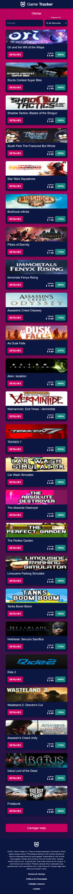
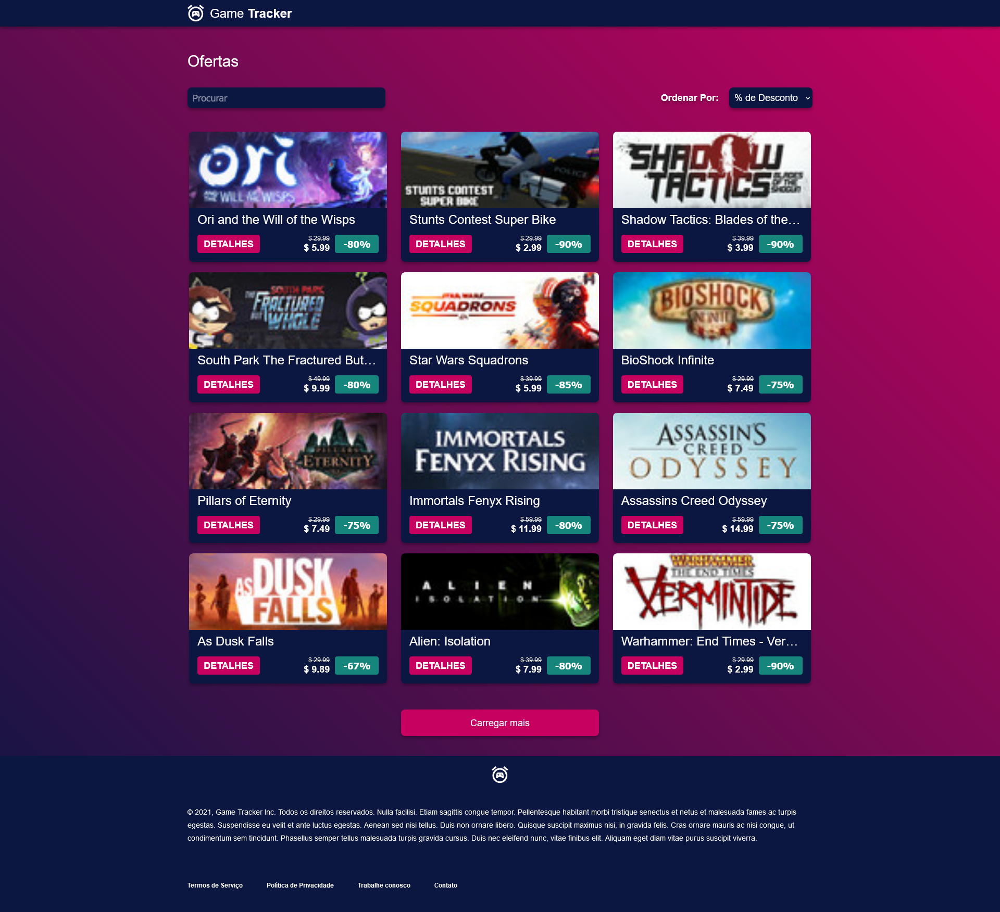

# Game-Tracker

The project consists of a single page application that queries game offers via the [Cheap Shark API](https://apidocs.cheapshark.com/) and exposes games on sale. The project can be accessed in production at this [link](https://game-tracker-vokubo.onrender.com).The project was developed for a front-end developer job application process, and its publication was allowed by the recruiter.

## Technologies Used and Justifications

|     Scope     |  Used   |
| :-----------: | :-----: |
|   Language    | Javascript |
|    Styling    |   CSS   |
|   Requests    |  Axios  |
| Framework (optional) | Vite+Vue |

The chosen framework for the project was Vite+Vue, with Vite being a bundler that allows for a simple and fast structured development environment. Vue was chosen because it is a versatile, well-documented and easy-to-structure framework.

## How to Run the Application

### Requirements

- Node.js 16.16.0

### `yarn`

In the application directory, run the following command above to install the dependencies

### `yarn dev`

And the above command to run the application at the URL http://127.0.0.1:5173/

## Features

<ul>
    <li>Responsive design with breakpoints at 480px, 768px and 1024px.</li>
    <li>Sorting of promotions by % Discount, Highest Price, Lowest Price and Title.</li>
    <li>Search by title in offers.</li>
    <li>Implemented Router.</li>
    <li>List of promotions are saved in cache so that upon returning to the navigation, the user does not get lost if they visit other pages of the application from the main one.</li>
    <li>Configured tests with Vitest.</li>
    <li>Functions as a PWA.</li>
</ul>

## Screenshots

    

        
Mobile Design

        
    

    

        
Desktop Design

        
    

        
Screens with various promotions loaded

        
    

## Future Ideas for the Project

<ul>
    <li> Storybook of components.</li>
    <li> Convert the project to SSR with NUXT.</li>
</ul>
